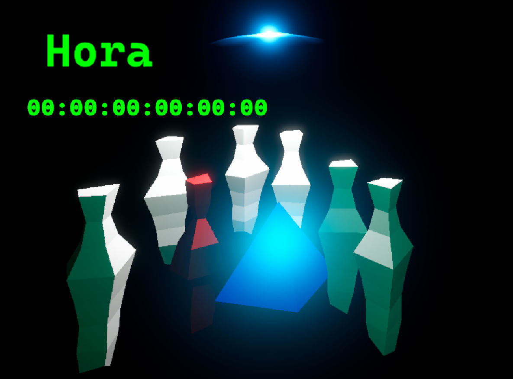

Description
-
### EN
This project contains code written during the GGJam25, where I participated and created a game called "Hora", named, coincidentally, (I just typed random letters) as goddess of the seasons in ancient Greek mythology, who was in charge of order in nature.

This code was written in 21 hours of work with a big break in the middle. Although the jam lasted 48 hours, I had reasons why I could not spend the entire time.

There is a major architectural flaw in the code. Initially, the whole architecture was supposed to look like a mediator (Main) with observers, but in the end it just separated the input, UI and logic.

But there is a positive side in the form of Data Driven Design, which is used to move many pieces.

And I'm proud that I have my first finished (at least in the sense that it has everything necessary to call it a game) project, which was done in a limited time.

More on itch.io:
https://paranormalkrono.itch.io/hora

### RU
Этот проект содержит код, написанный во время GGJam25, в котором я принял участие и создал игру под названием "Hora", названную, по случайности (я просто натыкал случайные кнопки), в честь богини времён года в древнегреческой мифологии, которая отвечала за порядок в природе.

Этот код был написан за 21 час работы с крупным перерывом в середине. Хотя джем длился 48 часов, у меня были причины, по которым я не мог полностью потратить всё время.

В коде есть крупный архитектурный недочёт. Изначально предполагалось, что вся архитектура будет выглядеть как посредник (Main) с наблюдателями, но в итоге вышло лишь разделить ввод, пользовательский интерфейс и логику.

Но есть и положительный момент в виде Data Driven Design, который использован для перемещения множества фигур.

И я горжусь тем, что у меня появился первый законченный (хотя бы в смысле того, что есть всё необходимое, чтобы назвать это игрой) проект, который был сделан за ограниченное время.

Больше на itch.io:
https://paranormalkrono.itch.io/hora